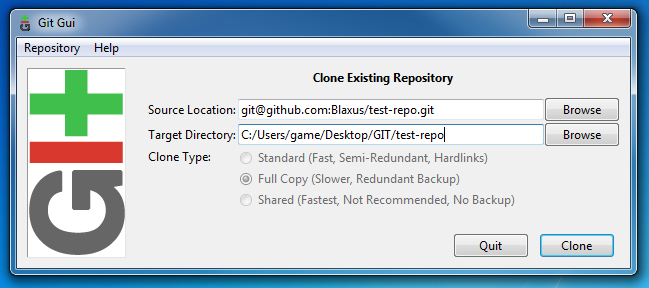
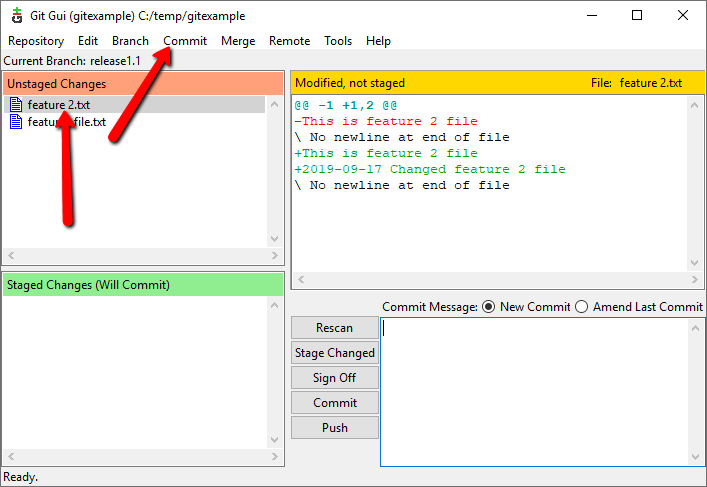
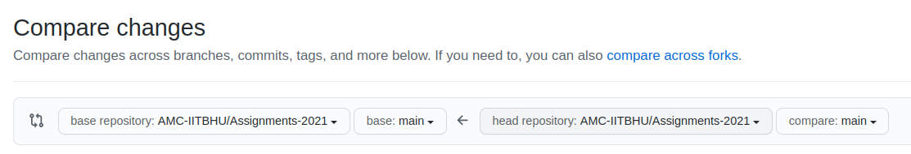

# Assignments-2021
This contains assignments which would be considered in the evaluation process for [DroneTech](https://github.com/AMC-IITBHU/DroneTech).


## HOLA FACCHO!!
we present you the repository and the work flow in which we want you to present us your code and be a active part of our family.
Here is the basic setup that we would like you to have such that its easier for you to learn and contribute to the world of drones and planes.
To see what we do please visit our
<center>
<a href= "https://www.youtube.com/user/amciitbhu"></a>,
<a href="https://www.instagram.com/amc.iitbhu/"></a>,<a href="https://www.facebook.com/amc.iitbhu/"></a> Channel, and Social Media account : )
</center>

## Installation
Hope you installed [```Anaconda```](https://www.anaconda.com/products/individual) if not click it.

Next intall [```git```](https://git-scm.com/downloads).After that there are two ways to go about it.

- ### 1. GUI-Based(Graphical User Interface).
Login to github and star this repository and then fork this repository by pressing this button on the top right corner.
 now you would mostly have a copy of this repository under your username.
Now take your time to copying your ```clone-link``` and put it in your Git-Gui application like so.

- ### 2. CLI-Based(Command Line Interface)
After setting up github on cli. you can go through this for that [Atlasian Tutorial](https://www.atlassian.com/git/tutorials/install-git).
Then
Fork this repo as shown above and then go to your repo and fetch your ```clone-link```.
```bash
git clone https://github.com/<--Your-Username-->/Assignments-2021.git
cd Assignments-2021
```

This should have opened up the workspace were you should write your own code.
## Instructions
Go to respective folders for each weeks content and there assignments.
Weeks
- [Week1](Week1/)
- ..

## After coding
You have to add it, commit it, and then push it.
- ### Add
This simply makes the code ready to commit.
- ### Commit
This takes a photograph of your whole code base and store it in your computer.
- ### Push
This pushes or uploads your photograph so that others can also see it.
### Git GUI
As simple as just pushing a button to do all the three above.

### Git CLI
```bash
## At The Assignment-2021 folder
git add .
## This adds up all the changes accorded till now.
git commit -m "info about your current code"
## This makes the changes into a compressed format and stores it
git push origin main
## This uploads your changes to the cloud for others to see on your repo.
```

## Pull Request
Now after making all the changes you like to submit your code for evaluation you are requested to make a pull request to [this repo](https://github.com/AMC-IITBHU/Assignments-2021/pulls).
Click on new pull requests and click on accross forks.

 and also select your Assignment repo under your username. 

Then just fill in the details about your approach if you want to write something special if you want to and our automatic grading system will do its majic accompanied by a mentor adding details or suggestions to your work and also giving :star2: or :heart: or :nerd_face:(my favorite) based on your submissions.

**And the Main power of Git is to learn from others codes, i.e., we expect you to learn from others good code and learn to improves others bad code as well.**

## Happy Forking
Yours nerdy,
<table>
 <td align="center">
     <a href="https://github.com/hex-plex">
    <br /><sub><b>Somnath Sendhil Kumar </b></sub></a><br />
    </td>
  <td>... Hope to see you ... </td>
</table>
