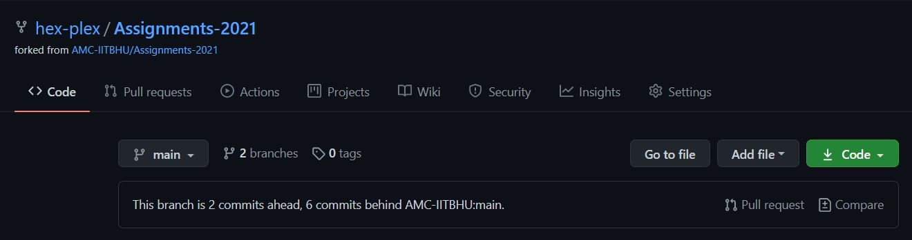
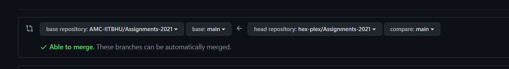
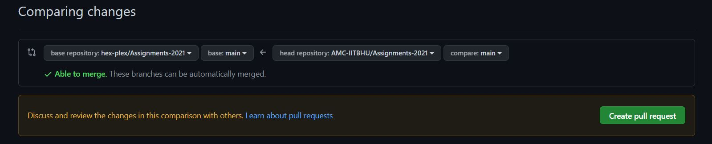
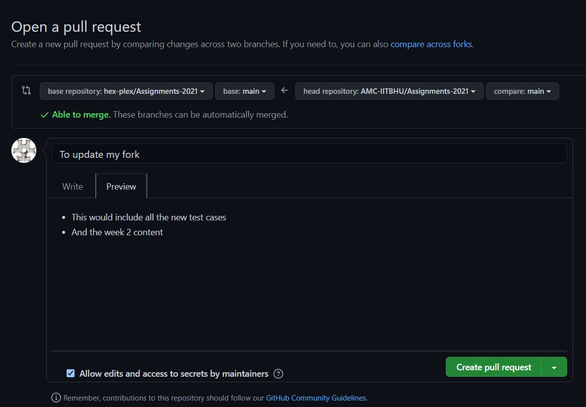
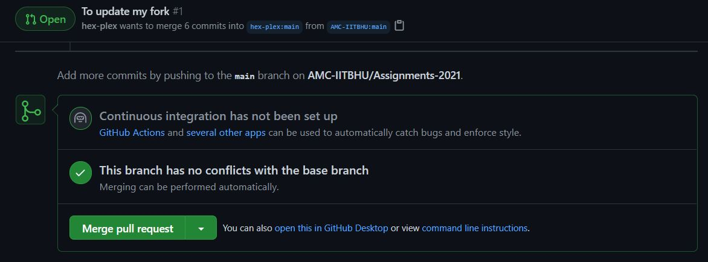

## Week 2
Hello freshers hope you got around gitting on the github, lets go to next week now where in we expect you to solve and learn (more importantly) Numpy.
## Resources
- Python and Numpy
  - [Youtube Video by AMC](https://www.youtube.com/watch?v=VD2TLfD5o00)
  - [Python Cheatsheet](https://docs.python.org/3/library/functions.html)
  - [Quick Overlook Video](https://www.youtube.com/watch?v=xECXZ3tyONo)
  - [Cheatsheet for numpy](https://towardsdatascience.com/numpy-cheat-sheet-4e3858d0ff0e)
- OpenCV
  - [YouTube Video by AMC Part 1](https://www.youtube.com/watch?v=c-F9QQwXwKI)
  - [YouTube Video by AMC Part 2](https://www.youtube.com/watch?v=Yxui7DvAl68)
  - [Sentdex Series for OpenCV](https://www.youtube.com/watch?v=Z78zbnLlPUA)
  - [Sentdex Website](https://pythonprogramming.net/loading-images-python-opencv-tutorial/)
- All The Presentations
  - [AMC Presentations](https://drive.google.com/drive/folders/12ppUwuNf-yX434SFVJXqXnPg0Y60UUjW)
  
## Instructions
Now believing you have forked the following repository when we had given Week1 Assignments we believe, a lot of you are scratching your heads on how to get your hands dirty with the Week2 assignments hence the reason for the following section.
(If you are visiting this repository the first time forking directly will fetch all the assignment at once and you may exclude the following step completely)
There are again two ways for doing the Same
### GUI (github.com)
 - **Step 1** : Open up your forked repository. You may see the following
                
                **Click on Pull Request**
 - **Step 2** : You may see the direction of the arrow but now you got to reverse it as in you got to update your own repo
                
                This is what you might see change it to the following
                
                **You may have to select compare across forks if the username hides itself**
                **Select Create Pull Request**
 - **Step 3** : Now simply write something about that and make the pull request.
                
 - **Step 4** : Now to merge the updates to your code base just select merge.
                
                **This would have merged all the latest updates from AMC repository to yours**
### CLI (git)
You can do all this in your terminal by the following commands ( this is assuming you have been doing all your work in the git terminal else do not follow this).
```bash
git remote add upstream https://github.com/AMC-IITBHU/Assignments-2021.git
git pull upstream main
git add .
git commit -m "Merged Updates"
git push origin main
```

## NOTE : These steps can be done to update your own repository hence it may be useful to learn them and bookmark as we would be doing this couple a lot more times
